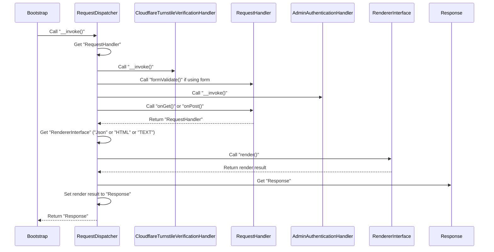

# aura-app

Aura.PHP application

## Library

### Backend

* Template Engine / [Qiq](https://github.com/qiqphp/qiq)
* Session / [Aura.Session](https://github.com/auraphp/Aura.Session)
* Auth / [Aura.Auth](https://github.com/auraphp/Aura.Auth)
* Accept / [Aura.Accept](https://github.com/auraphp/Aura.Accept)
* Router / [Aura.Router](https://github.com/auraphp/Aura.Router)
* DI / [Aura.Di](https://github.com/auraphp/Aura.Di)
* Env / [Koriym.EnvJson](https://github.com/koriym/Koriym.EnvJson)

### Frontend

* JavaScript bundler / [Rollup](https://rollupjs.org)

### Features

* ID & password login
* Flash message

### Architecture



## Execute on CLI

```bash
composer run cli get /hello
```
